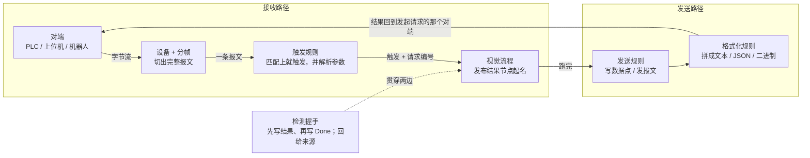
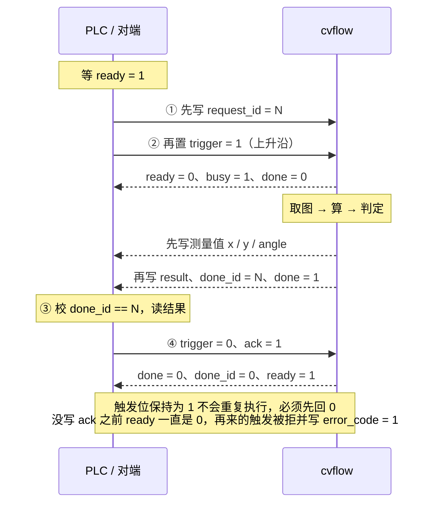

# CVFlow 通信使用说明书

面向第一次配通信的人：从零配通，每一步点哪里、填什么、怎么验证。

> 协议细节、寄存器映射与三个示例的联调步骤见 [comm-examples.md](comm-examples.md)；
> 实现与边界见 [README 的「PLC 联动」](../README.md#plc-联动)。

---

## 五分钟看懂

整套通信就是把一条请求从对端接进来、跑一次流程、再把结果送回去。中间每一层都是一个页签里的一条配置。



上一行是请求进来的路，下一行是结果出去的路；握手横跨在下面，管的是请求编号跟结果对得上、回复发给正确的对端。

寄存器设备（Modbus/MC/S7）在「设备 + 分帧」那一层多一个**数据点表**，给地址起名字。

### 五个概念

| 概念 | 一句话 | 不配会怎样 |
|---|---|---|
| **设备** | 一条通往外部的链路（TCP/串口/Modbus…） | 没有设备就什么都做不了 |
| **分帧** | 告诉软件「一条报文到哪里结束」 | 配错就永远收不到完整报文 |
| **规则** | 收到什么触发哪条流程；跑完把结果发给谁 | 设备连上了但流程不动 |
| **数据点** | 给寄存器地址起名字（只有 Modbus/MC/S7 要）| 只能到处填裸地址，改一个地址要改好几处 |
| **握手** | 请求编号、Ready/Busy/Done、对端确认的闭环 | 多台上位机时结果会发错对象；忙的时候对端不知道 |

### 先配哪个

按这个顺序走，每一步都能单独验证，不用最后一起调：

1. **设备**（含分帧）→ 用 `测试连接` 验链路通不通
2. 寄存器设备多一步：**数据点** → 用调试页的手动读写验每个点
3. **解析规则**（文本协议）→ 解出请求编号和参数
4. **触发规则** → 让对端发一条，看流程运行计数有没有涨
5. **格式化规则 + 发送规则或握手** → 结果回去

最常见的两种配法在后面两节有逐步操作：文本报文看「场景一」，寄存器看「场景二」。

---

## 动手之前

通信面板在主窗口**下方的「通信」页签**里，和「结果」「变量」「日志」并排。整套通信功能都在这里配，不用写代码。

装的时候两条命令二选一：

```bash
pip install -e .            # 只跑软件。Modbus 主站从站都是自带实现，不装 pymodbus 也能用
pip install -e ".[dev]"     # 要跑测试。pymodbus 和 python-snap7 在这里面，只作测试对端
```

串口和西门子 S7 是可选依赖：没装 pyserial 或 python-snap7，软件照常启动，只是这两类设备在「测试连接」时会明确告诉你缺哪个包。

### 七个页签各管什么

| 页签 | 管什么 | 什么时候动它 |
|---|---|---|
| **设备** | 一条通往外部的链路：协议、地址、分帧、重连 | 第一步，必配 |
| **数据点** | 给 Modbus/MC/S7 的寄存器地址起名字 | 只有寄存器类设备需要 |
| **触发** | 什么情况下触发哪条流程 | 第二步，必配 |
| **发送** | 流程跑完把结果发出去 | 用检测握手回结果时可以不配 |
| **解析/格式** | 报文怎么拆成字段、结果怎么拼成报文 | 文本协议基本都要配 |
| **握手** | 把设备和流程绑成请求—执行—回传—确认的闭环 | 产线上建议配；只要单向发数据可以不配 |
| **调试** | 手动收发、看报文、Modbus 手动读写、导出日志 | 全程都在看 |

### 两件最容易踩的事

**编辑模式下设备不连接、流程也不接受触发。** 配完必须点工具栏的 **进入运行模式**，设备才会连上、规则才会生效。「设备」页的状态列会从「○ 未连接」变成「● 已连接」。对端连不上、脚本一直在等，九成是这一步没点。

**Linux 上 502 端口起不来。** 502 是特权端口，要 root。调试统一用 5020，自带示例也都用 5020。

---

## 场景一：上位机发报文要结果

这是最常见的一种：上位机或机器人连过来，发 `TRIGGER,1001`，期待收到 `RESULT,1001,OK,425.400,243.000,0.002`。cvflow 做 TCP 服务端（它监听，对端连过来）。

先把流程里要回传的值用**「发布结果」节点起好名字**（比如 `x`、`y`、`angle`）——后面格式化规则里要用 `out.x` 这种形式引用它们。没发布过的值，通信那边取不到。

1. **设备**页 → `添加` → 类型选「TCP 服务端」。「协议参数」里监听地址填 `0.0.0.0`（所有网卡）、端口 `6000`。
2. 同一个对话框切到**「报文分帧」**页：分帧方式选「分隔符（如 LF / CRLF）」，分隔符填 `\n`。对端发 `\r\n` 就填 `\r\n`——**这一项必须和对端一致**，否则永远切不出完整报文。确定。
3. **解析/格式**页左边的「解析规则」→ `添加`。名称 `请求`，方式「按分隔符切分」，分隔符 `,`。字段表里两行：
   - `cmd`，第 **0** 段，类型 `string`
   - `request_id`，第 **1** 段，类型 `int`
4. 同一页右边的「格式化规则」→ `添加`。名称 `结果`，格式「文本」，分隔符 `,`，结束符 `\n`。字段表里从下拉框挑取值来源：
   - `literal:RESULT`（固定头）
   - `request_id`（请求编号）、`status`（OK/NG/ERROR）
   - `out.x`、`out.y`、`out.angle`，类型都选 `float`，小数位 `3`
5. 再加两条格式化规则（异常分支要用）：`忙` = `literal:BUSY` + `request_id`；`错误` = `literal:ERROR` + `request_id` + `error_code`。
6. **触发**页 → `添加`。设备选刚建的那台，触发来源「报文」，条件「前缀匹配」，文本内容 `TRIGGER`，动作「触发流程」→ 选你的流程，解析规则选 `请求`，流程忙时选「拒绝并回复忙」。
7. **握手**页 → `添加`。设备与流程选好，模式「文本报文」，结果回复选 `结果`、忙回复选 `忙`、错误回复选 `错误`。「策略」页保持默认即可。
8. **设备**页 → `检查配置`。应该弹「通信配置没有问题」；弹出问题列表就按里面的提示改。
9. 工具栏 → **进入运行模式**。「设备」页状态应该变成「● 已连接」。

### 怎么验证

不用等对端，自带脚本就能扑一下：

```bash
python examples/sim_handshake.py tcp --port 6000
```

它会把正常请求、参数错误、忙时、重复编号、多客户端路由五条分支全跑一遍并打印结果。同时看 **调试**页，每一条收发都会带着时间、方向、对端地址出现。

### 为什么要配握手而不是「发送规则」

两种都能把结果发出去。区别在于：发送规则只管「流程跑完了，发一条」；握手还管**请求编号跟结果对得上**、**回复发给发起请求的那个客户端**、**忙的时候明确拒绝**、**断线重连后不把旧结果发给新连接**。只有一台上位机、节拍又宽的场合，光用发送规则也行。

---

## 场景二：PLC 写寄存器触发（cvflow 做从站）

PLC 做主站、cvflow 做从站——**产线上这种更稳**：PLC 的每一次写入都被立即看到，不靠轮询，不会漏脉冲。

### 先把地址规划好

别一上手就配，先和电气商定下来哪些地址干什么。自带示例的映射可以直接照抄（`demo_modbus_slave.json`）：

| 数据点 | 协议地址 | 参考地址 | 类型 | 方向 | 含义 |
|---|---|---|---|---|---|
| `trigger` | 0 | 40001 | int16 | 读写 | PLC 写 1 触发一次检测 |
| `request_id` | 1–2 | 40002 | int32 CDAB | 读写 | 本次请求编号，PLC 写 |
| `ready` | 3 | 40004 | int16 | 写 | 1 = 可以接新任务 |
| `busy` | 4 | 40005 | int16 | 写 | 1 = 正在执行 |
| `done` | 5 | 40006 | int16 | 写 | 1 = 结果已写完，可以读 |
| `result` | 6 | 40007 | int16 | 写 | 1 = OK，2 = NG |
| `error_code` | 7 | 40008 | int16 | 写 | 见错误码表 |
| `done_id` | 8–9 | 40009 | int32 CDAB | 写 | 本次完成对应的请求编号 |
| `ack` | 10 | 40011 | int16 | 读写 | PLC 写 1 表示已取走结果 |
| `x` `y` `angle` | 21 23 25 | 40022… | float32 CDAB | 写 | 测量值 |
| `heartbeat` | 30 | 40031 | int16 | 写 | 视觉在线心跳，每秒自增 |

留出空档是有意的：状态信号在 0–10，测量值从 20 开始，以后加一两个测量值不用动前面。

### 配置步骤

1. **设备**页 → `添加` → 类型选「Modbus TCP 从站（对端读写本机）」。监听 `0.0.0.0`、端口 `5020`、从站站号和 PLC 一致（通常 1）。保持寄存器数量够用（默认 256 个已经很宽敞）。
2. **数据点**页 → 上方设备下拉框选刚建的那台 → 按上表逐条 `添加`。每条要填：名称、数据区（选「保持寄存器 (4x)」）、地址、类型、读写方向。对话框会实时显示**参考地址**和**字节序的实际字节示例**，照着核对就行。
3. **触发**页 → `添加`。设备选那台，触发来源改成**「数据点 / 寄存器」**，条件选「上升沿（0 → 非 0）」，数据点从下拉框选 `trigger`，请求编号字段填 `request_id`，动作「触发流程」。
4. **发送**页 → `添加`。设备选那台，发送条件「每次」，在**「写数据点」**框里填测量值的对应关系：
   ```json
   [{"point": "x", "source": "out.x"},
    {"point": "y", "source": "out.y"},
    {"point": "angle", "source": "out.angle"}]
   ```
   文本模板那一格留空——寄存器协议不发文本。
5. **握手**页 → `添加`。模式「寄存器信号（Modbus / MC / S7）」，然后把八个信号从下拉框逐个选上：就绪←`ready`、忙←`busy`、完成←`done`、判定结果←`result`、错误码←`error_code`、请求编号←`request_id`、完成编号←`done_id`、确认位←`ack`。「策略」页勾上**「需要对端确认后才复位」**。
6. `检查配置` → **进入运行模式**。

### 怎么验证

```bash
python examples/sim_handshake.py master --port 5020
```

这个脚本扮成 PLC 主站：写请求编号、置触发位、等 `done`、读结果、写确认，每一项都打印核对结果（完成编号是否一致、忙标志是否出现过、心跳计数）。也可以直接用你手上的 Modbus 调试工具（Modbus Poll 之类）连 `5020` 试。

还没接 PLC 也能先练：「调试」页的 **Modbus 手动读写** 那一条，选设备和数据点，点 `写入` / `读取` 就能单独验一个点配对了没有。把 `trigger` 写成 1，流程应该立即跑一次。

---

## 场景三：cvflow 主动读写 PLC（做主站）

PLC 端不愿意改程序、或者它本身只能做从站时用这种。

**数据点映射和场景二完全一样，可以整张照抄。** 这正是数据点表的用处：流程和握手都按**名字**引用，地址和谁是主站是设备那一层的事。换角色只需要改三个地方：

1. **设备**页新建时类型选「Modbus TCP 主站（读写对端）」，填 PLC 的 IP 和端口（不再是监听地址）。
2. **数据点**页里，PLC 会写、我们要读的那几个点（`trigger`、`request_id`、`ack`）把**轮询周期**填成 `20`（毫秒）。主站是主动去读的，不设轮询就永远不知道 PLC 改了值。其余只写的点保持 `0`。
3. 其它全部照旧。

### 两个要注意的地方

**启动顺序反过来了。** cvflow 是主站，要先有个从站给它连。用自带脚本练手时：

```bash
python examples/sim_handshake.py slave --port 5020          # 先起模拟 PLC
cvflow serve examples/solutions/demo_modbus_master.json     # 再开 cvflow
```

**比轮询周期还短的脉冲会漏。** 主站是周期性去读的，若 PLC 的触发位只置 1 一个扫描周期就自己清零，有可能恰好落在两次轮询之间。要求一次不漏就让 PLC **保持触发位直到看到 `busy`**，或者改用场景二（做从站，对端每次写入都被看到）。

---

## 分帧怎么选

TCP 和串口都是**字节流**：一次收到的可能只是半条报文，也可能是好几条粘在一起。分帧就是告诉软件「一条报文到哪里结束」。**这项必须和对端一致**，配错了什么都跑不通。

先问对端一句：你发的报文怎么分段？然后对照这张表：

| 对端的报文长这样 | 选哪种 | 要填什么 |
|---|---|---|
| `TRIGGER,1001\n`——每条末尾一个固定结束符 | **分隔符** | 分隔符填 `\n` 或 `\r\n`；非打印字符写 `\x03` 这种 |
| 每条正好 16 字节，不足补零 | **定长** | 定长字节数填 16 |
| 开头几字节里有个长度字段 | **长度前缀** | 长度字段的偏移、字节数（1/2/4）、字节序，以及它**算的是哪一段** |
| 对端保证一次就发一整条（或只是调试） | **原始字节** | 什么都不填。注意它**不保证报文完整性** |

UDP 没有这一项：一个数据报天然就是一条报文。

### 长度前缀的那个「算哪一段」

这是最容易配错的一项。三个选项对应协议手册里三种写法：

- **仅数据区**：长度 = 报文头之后的字节数。最常见。
- **整条报文**：长度 = 含报文头在内的总长。
- **长度字段之后的全部字节**：报文头里长度字段后面还有别的字段时用它。

拿一条真实报文数一数就能定：长度字段里写的数，等于哪一段的字节数。

### 配错了会看到什么

| 症状 | 原因 |
|---|---|
| 完全没反应，调试页一条收的记录也没有 | 分隔符不匹配（对端发 `\r\n`、你填 `\n` 也能切出来，但反过来不行）；或对端根本没发结束符 |
| 收到的报文末尾多了奇怪字符 | 分隔符只填了 `\n`，对端实际发 `\r\n` |
| 收到的是半条，或两条粘成一条 | 选了「原始字节」，它不干拼接这件事 |
| 收几条正常之后开始全乱 | 长度前缀的「算哪一段」选错，一旦错位就一路错下去 |
| 日志里出现「超过单条上限」或「未收齐」 | 分帧配错导致永远等不到结束；保护机制把缓冲清了 |

定不下来的时候，先把分帧设成**原始字节**，进运行模式，让对端发一条，到「调试」页看**十六进制列**——末尾是 `0a` 还是 `0d 0a`、开头有没有长度字段，一眼就能看出来，然后再回去改成对应的分帧方式。

---

## 数据点与字节序

数据点就是**给寄存器地址起个名字**，连带说清它是什么类型、什么字节序、该不该轮询。配了之后，流程、触发规则、检测握手都从下拉框选名字，**改地址不用改流程**。

### 地址：协议地址 vs 参考地址

同一个寄存器有两种写法，这是 Modbus 历史遗留的坑：

- **协议地址**：报文里实际传的那个数，从 **0** 开始。cvflow 内部统一用这个。
- **参考地址**：40001 那一套，从 **1** 开始，带数据区前缀。很多 PLC 手册和调试工具用这个。

| 数据区 | 参考地址从 | 位/字 | 远程可写 |
|---|---|---|---|
| 线圈 (0x) | 1 | 位 | 是 |
| 离散输入 (1x) | 10001 | 位 | 否（协议没有写功能码）|
| 输入寄存器 (3x) | 30001 | 字 | 否 |
| 保持寄存器 (4x) | 40001 | 字 | 是 |

数据点对话框里你填的是**协议地址**，下面会实时显示对应的参考地址。电气给的是 `40011`，你填 `10`，对话框会回显「40011（4x，协议地址 10）」——对上了就没错。

常用一产线上还有两个坑：**离散输入和输入寄存器是只读的**，Modbus 协议本身没给它们写功能码。把这两个区的数据点方向设成「写」会在保存时被拦下来。

### 字节序：四种布局怎么选

32 位数据（int32 / float32）占两个寄存器，而不同 PLC 摆这两个寄存器的顺序不一样。以大端值 `0x12345678` 为例，四种布局发出去的字节分别是：

| 布局 | 寄存器 0 | 寄存器 1 | 实际字节 | 谁在用 |
|---|---|---|---|---|
| `ABCD` 大端（不交换）| `12 34` | `56 78` | `12 34 56 78` | 标准大端设备 |
| `CDAB` 寄存器间字交换 | `56 78` | `12 34` | `56 78 12 34` | **国内 PLC 最常见的默认** |
| `BADC` 寄存器内字节交换 | `34 12` | `78 56` | `34 12 78 56` | 少见 |
| `DCBA` 两者都交换 | `78 56` | `34 12` | `78 56 34 12` | 完全小端的设备 |

**字节交换和字交换是两件事**：字交换是摆两个寄存器的前后顺序（`CDAB`、`DCBA`），字节交换是摆一个寄存器内部两个字节的顺序（`BADC`、`DCBA`）。所以 16 位类型只受字节交换影响，`ABCD` 和 `CDAB` 对它是一模一样的。

### 不知道该选哪个怎么办

别猜，用字节比一下就行，三步：

1. 数据点对话框里每改一次字节序，下面的**字节示例**那一行就跟着变——它写的就是这个布局实际会发出什么字节。
2. 让对端把一个**已知的值**写进来（比如 `1.5`），或者用「调试」页的 Modbus 手动读写把 `1.5` 写过去。
3. 对端读到的是 `1.5` 就对了；读到一个离谱的大数或者极小的数，换一个布局再试。四种最多试四次。

先试 `CDAB`，国内设备命中率最高。

### 缩放系数和绑定变量

**缩放系数**解决的是「PLC 只能收整数但我要传小数」。例：宽度 `401.03` mm，想用 int16 传两位小数，就把类型设 `int16`、缩放系数设 `0.01`。写的时候自动变成 `40103` 发出去，读的时候自动换回 `401.03`。PLC 那边自己除 100。

**绑定全局变量**解决的是「PLC 下发的参数要给流程用」。比如 PLC 在某个寄存器里写产品型号编号，把这个数据点的「绑定全局变量」填成 `product_type`，每次读到新值就自动写进该变量，流程里用「读变量」节点或模板里的 `{var.product_type}` 就能取到。

> 注意区分：绑定变量是「最新值」，适合显示和换型；如果是**跟着每一次请求走的参数**，要用握手冻结的那份（「触发数据」节点），否则多个请求排队时会串。

### 轮询周期怎么填

- **cvflow 做从站**（场景二）：全部填 `0`。对端的每次写入都被立即看到，不需要轮询。
- **cvflow 做主站**（场景三）：对端会写、我们要读的点填 `20`～`50` 毫秒；只写的点填 `0`（它们不需要读回来）。填得越小响应越快，但占得越多链路带宽。

地址相邻的数据点会自动合并成一次请求，所以把要轮询的几个点摆在一起比散得很开快。

---

## 检测握手

握手把一台设备和一条流程绑成完整闭环：**外部请求 → 接受任务 → 执行 → 发布结果 → 对端确认**。



PLC 侧的梯形图照这个写就行：等 `ready` → 写编号 → 置触发 → 等 `done` → 校 `done_id` → 读结果 → 清触发并写 `ack`。

### 八个信号

| 信号 | 谁写 | 含义 |
|---|---|---|
| `ready` | cvflow | 1 = 现在能接新任务。**反映真实能力**：设备已连 + 流程在跑 + 不忙 + 不在等确认 |
| `busy` | cvflow | 1 = 已接受任务、正在执行 |
| `done` | cvflow | 1 = 结果已经写完，可以读了 |
| `result` | cvflow | 判定：1 = OK，2 = NG（可配）|
| `error_code` | cvflow | 0 正常；1 忙、2 参数错、3 流程异常、4 超时、5 流程未运行、6 重复请求 |
| `request_id` | **对端** | 本次请求编号，握手只读它 |
| `done_id` | cvflow | 本次完成对应的请求编号。**对端用它确认结果属于哪一次请求** |
| `ack` | **对端** | 写 1 = 已取走结果，握手据此复位 |

每一个都可以留空不用。最简的用法只配 `done` 一个；PLC 要判「现在能不能发」就加 `ready`；要校对应关系就加 `request_id` + `done_id`。

### 三条硬保证

1. **先结果、后 Done**。发送规则写完测量值，握手才写 `done` 和 `done_id`。所以 PLC 只要等 `done` 翻转，读到的一定是本次的数据，不需要额外的延时约定。
2. **结果绑定请求**。接受任务的那一瞬间就把请求编号、输入参数、**来源对端**冻结下来。TCP 服务端因此总能回给正确的那个客户端。
3. **断线不重放**。接受任务时记下设备的连接代号；流程跑完发现代号变了（中间断过线），结果直接丢弃并记日志。

### 忙时和超时怎么选

**流程忙时**三选一：

- **拒绝并回复忙**（推荐）——对端明确知道这一次没被接受，可以等一下重发。
- **有界排队**——排队执行，队列满了才回忙。节拍比检测快的对端适用。
- **静默丢弃**——不回复。只在对端不关心单次结果时用。

**超时**（「策略」页的流程超时）设成比正常节拍宽裕两三倍。超时后软件**只上报错误码 4，不重发触发也不重写**——重发可能让对端执行两次物理动作。

**重复请求**（同一个编号在去重窗口内再来一次）三选一：重发上次结果（文本协议推荐，对端可能没收到）、忽略（寄存器协议推荐，结果还在寄存器里）、当成新请求重跑。

**等确认超时自动复位**建议设一个值（比如 10 秒）。`ack` 迟迟不来时不至于永远卡在「等确认」。

### 文本模式有什么不同

信号不是寄存器而是**报文**，由格式化规则渲染：结果回复、忙回复、错误回复（还有一个可选的受理回复）。请求编号从**解析规则**的字段里取，所以触发规则里的「请求编号字段」要和解析规则里的字段名一致（默认都是 `request_id`）。其余策略完全一样。

---

## 在流程里主动收发

大部分情况用不上这些节点——「触发规则 + 发送规则 + 握手」已经把流程开头和结尾都管了。节点解决的是**流程中间**要收发的情况。

节点库里的「通信」分类有 7 个：

| 节点 | 做什么 | 什么时候用 |
|---|---|---|
| 接收报文 | 从收件箱取一条报文 | 流程中间要等对端再发一条（比如等条码枪）|
| 发送报文 | 发文本或十六进制 | 中间先回一个「已收到」；或分步回传 |
| 解析报文 | 用解析规则把报文拆成字段 | 要拿请求里的参数做分支判断 |
| 格式化结果 | 用格式化规则拼成报文 | 要自己控制什么时候发 |
| 读数据点 | 按名字读一个 Modbus/MC/S7 数据点 | 流程里要看 PLC 的某个状态再决定怎么算 |
| 写数据点 | 按名字写一个数据点 | 中间结果就要给 PLC，不等流程跑完 |
| 通信状态 | 查设备/握手的实时状态 | 配合判定节点：设备掉线就直接判 NG |

还有一个在**「采集」分类**里：**触发数据**。它把本次请求被接受时**冻结**的东西取出来：请求编号、解析出的字段、来源对端。多个请求排队时也不会串——这是它和「读全局变量」的关键区别。要用请求参数做分支，用它，不要用变量。

### 参数怎么填

设备、数据点、规则这几个参数在参数面板里都是**下拉候选**，不用手敲：

- 设备下拉框显示的是**设备名**，存的是**稳定标识**——所以以后改设备名字，流程不会失去引用。
- 数据点的候选**跟着上面选的设备变**，先选设备再选数据点。
- 下拉框是**可编辑**的：「先摆节点、后建设备」这个顺序也能用，手填的名字不会被清掉。

**发送报文**节点的「发给谁」默认是 `origin`（回复本次请求的来源客户端）。多台上位机同时连着时，这个默认值是对的；要广播给所有人才改成 `broadcast`。

### 为什么节点不自己建连接

所有节点都是通过全局通信管理器找设备的，**不自己建连接**。这样同一台设备能被多条流程引用，也不会出现两段代码抢读同一个连接。

接收这边特别说一下：**后台监听线程是唯一读套接字的一方**，收到的报文复制进各个收件箱，「接收报文」节点从自己的收件箱取。所以节点和触发规则不会互相抢报文。收件箱有容量上限，满了丢最旧的——产线上最新那条才有意义。

---

## 调试：出问题先看哪里

### 三个工具各查什么

| 工具 | 在哪 | 查什么 |
|---|---|---|
| `测试连接` | 设备页 | **链路通不通**。会真做一次有意义的探测：TCP 报连接耗时，Modbus/MC/S7 真读一个数据点并报回值和耗时，串口先敲举本机端口再试开 |
| `检查配置` | 设备页 | **配置自身有没有矛盾**。引用了不存在的设备/流程/规则、数据点非法，一次性全列出来 |
| 调试页的日志 | 调试页 | **到底收到/发出了什么**。时间、方向、设备、对端、字节数、文本、十六进制、说明 |

### 调试页怎么用

**手动发送**：选设备，选「文本」或「十六进制」，输入内容，点 `发送`。文本模式可以写 `\n`、`\r\n` 这种转义；十六进制模式写 `02 41 42 03`。TCP 服务端有多个客户端时，「对端」下拉框能指定只发给哪一个。

**Modbus 手动读写**：选设备和数据点，`读取` / `写入` 单独验一个点。勾上「持续监视」就每 250 毫秒自动读一次，盯着一个寄存器看它什么时候变很好用。

**日志**：可以按**方向**（收/发/错误/状态）、**设备**、**关键字**筛选。报文密度大的时候勾「暂停滚动」能定住画面仔细看；「停止记录」是真的不再往里写。`导出 CSV` 把当前日志整份存下来，跟电气扣报文细节时直接发过去。

日志有容量上限，满了丢最旧的并在右上角显示丢弃条数。界面是每 250 毫秒批量刷一次，不是来一条刷一次，所以高频通信不会把界面卡住。

### 握手页也是个调试页

「握手」页的表格是**实时**的：状态（就绪/执行中/已完成/等待确认/离线）、当前请求编号、错误码，以及已接受 / 已完成 / 忙拒绝 / 超时四个计数。

调试时这几个计数比日志更快定位：**已接受为 0** = 触发没进来（查触发规则和分帧）；**已接受有、已完成为 0** = 流程没跑完（查流程本身）；**忙拒绝一直涨** = 上一次没复位（通常是 `ack` 没写）。

---

## 不接真 PLC 怎么练手

仓库自带三个完整示例，用的是同一条视觉流程（数孔 + 两把卡尺测宽与偏转角 + 圆查找定位），区别只在通信那一侧。先生成方案：

```bash
python examples/build_handshake_demos.py
```

| 想练什么 | 第一步 | 第二步 |
|---|---|---|
| TCP 请求—应答 | `cvflow serve examples/solutions/demo_tcp_handshake.json` | `python examples/sim_handshake.py tcp` |
| cvflow 做 Modbus 主站 | `python examples/sim_handshake.py slave` | `cvflow serve examples/solutions/demo_modbus_master.json` |
| cvflow 做 Modbus 从站 | `cvflow serve examples/solutions/demo_modbus_slave.json` | `python examples/sim_handshake.py master` |

**注意启动顺序**：谁是服务端/从站，谁就先起。中间那一行 cvflow 是主站，所以要先起模拟 PLC。

想在界面里看而不是命令行，把 `cvflow serve` 换成 `cvflow gui`，打开后记得点**进入运行模式**。

跑 TCP 那个应该看到这样的输出：

```
【1】正常请求：期望 RESULT,<编号>,OK,<x>,<y>,<角度>
  → TRIGGER,1001    ← RESULT,1001,OK,425.400,243.000,0.002    86 ms
【2】参数错误：请求编号不是数字
  → TRIGGER,abc    ← ERROR,0,2    错误码含义：参数错误
【4】重复编号：期望重发上次结果且不重跑流程
  ← 第一次 RESULT,1005,OK,324.600,233.400,-0.004
  ← 第二次 RESULT,1005,OK,324.600,233.400,-0.004    （一致 ✓）
```

**看不到 BUSY 是正常的**。示例流程只要 30～90 ms，连发两条时第一条往往已经跑完了。想复现忙时分支，往流程里插一个「延时」节点（200 ms 以上）再试。

报文格式、完整寄存器映射、握手时序都在 [comm-examples.md](comm-examples.md) 里。

---

## 产线部署

产线上不用开界面：

```bash
cvflow serve 你的方案.json
cvflow serve 你的方案.json --stats-every 30     # 每 30 秒打一行统计
```

启动输出长这样，每一行都有用：

```
设备 PLC（modbus_tcp_server）监听 0.0.0.0:5020，15 个数据点
检测握手 检测握手（register）：设备 PLC ↔ 流程 main
运行中：流程 ['main']，按 Ctrl-C 停止
[main] 运行=12 OK=11 NG=1 错误=0 平均=58.3ms 排队=0 | PLC:已连接 | 检测握手:就绪(受理12/完成12/忙拒0/超时0)
```

- 第一行确认**端口真的占上了**（端口配 0 让系统分配时，这里会打印实际端口）。
- 第二行确认**握手绑对了设备和流程**。
- 启动时还会把配置自检的问题打到 stderr（和界面上 `检查配置` 按钮是同一套检查）。
- 统计行里的 `排队` 长期不为 0，说明节拍跟不上触发频率；`超时` 在涨，说明流程有时跑不完。

日志重定向到文件：`cvflow serve 方案.json > 日志.txt 2>&1`。输出是行缓冲的，`tail -f` 能实时看到；Windows 下中文也不会因为代码页问题崩掉。

停止用 Ctrl-C 或发 SIGTERM；它会把握手信号收干净（Ready 置 0、忙标志清掉）、释放端口和后台线程，不会把 PLC 永远挂在「等结果」的状态。

---

## 故障对照表

按症状查。每一条的「先看哪里」都是界面上真存在的位置。

### 连不上

| 症状 | 最可能的原因 | 怎么查 |
|---|---|---|
| 对端连不上，脚本一直在等 | **没进运行模式** | 设备页状态列是不是「● 已连接」。九成是这个 |
| 设备显示「⊘ 已禁用」 | 设备被禁用了 | 设备页选中 → `启用/禁用` |
| 设备显示「○ 已手动断开」 | 点过 `断开`，之后不再自动重连 | 选中 → `连接`，这个标记会被清掉 |
| 进运行模式了但某台设备没连 | 该设备关了**自动连接** | 编辑设备 → 「连接与重试」页 |
| Linux 上监听 502 失败 | 502 是特权端口 | 改用 5020 |
| 端口被占 | 上一个进程还没退 | `测试连接` 会直说端口可不可用 |
| 串口打不开 | 被其它程序占用 / 没权限 / 端口不对 | `测试连接`，它会把本机实际有哪些端口列出来 |

### 连上了但不触发

| 症状 | 最可能的原因 | 怎么查 |
|---|---|---|
| 调试页**连收的记录都没有** | 分帧配错，永远切不出完整报文 | 把分帧改成「原始字节」看十六进制列，按「分帧怎么选」重配 |
| 调试页**收到了**但流程没跑 | 触发规则条件没匹配上 | 触发页核对前缀/正则；注意前后空格和大小写 |
| 规则对了依旧不跑 | 规则绑的流程名不存在 | 设备页 `检查配置` |
| **只触发了一次，之后不再响应** | 触发位一直保持在 1 | 这是**正确行为**：必须先回到 0 才会再次上升沿。让 PLC 清零，或开启握手的确认复位 |
| 回 `ERROR,...,2`（参数错误）| 报文不符合解析规则 | 调试页看原始报文，对照解析规则的字段下标 |
| 回 `ERROR,...,5`（流程未运行）| 没进运行模式 | 点进入运行模式 |
| 主站模式下偶尔漏一次触发 | 脉冲比轮询周期还短 | 调小轮询周期，或让 PLC 保持触发位到看到 `busy` |

### 数值不对

| 症状 | 最可能的原因 | 怎么查 |
|---|---|---|
| 浮点数读出来是个离谱的大数 | **字节序选错** | 按「不知道该选哪个怎么办」那三步试，先试 `CDAB` |
| 整数差了 100 倍或 1000 倍 | 缩放系数两边没对齐 | 数据点的缩放系数 × PLC 那边的除法要互逆 |
| 读到的永远是 0 | 读错数据区（3x 和 4x 是两张表）| 数据点的「数据区」和电气给的参考地址对不对得上 |
| 差了正好 1 个地址 | 协议地址当成参考地址填了 | 数据点对话框下方的参考地址回显 |
| 模板里 `{out.x}` 渲染成空 | 流程里没用「发布结果」节点发布 `x` | 在流程里加一个「发布结果」节点并起名 `x` |
| 数据点页显示「已过期」 | 链路断过，这是断线前的旧值 | 先解决连接；流程里读到过期值会明确报错而不是默默用旧值 |

### 握手卡住

| 症状 | 最可能的原因 | 怎么查 |
|---|---|---|
| `done` 一直不翻转 | 看握手页的**状态**和**错误码** | 「流程未运行」= 没进运行模式；「忙」= 上一次没确认；「超时」= 流程跑得比 `流程超时` 设的值还慢 |
| `ready` 始终是 0 | 设备未连 / 流程未跑 / 还在等确认 | `ready` 反映的是**真实能力**，四个条件全满足才置 1 |
| 第二次触发被拒，`error_code` = 1 | 上一次的 `ack` 没写 | PLC 读完结果要写 `ack` = 1；或在握手策略里设「等确认超时自动复位」 |
| 完成编号和请求编号不一致 | PLC 写触发位在写编号**之前** | PLC 正确顺序：先写 `request_id`，再置 `trigger` |
| 读到的结果是上一次的 | 没用 `done` 判断就去读 | 必须等 `done` 翻成 1 再读。软件保证「先写结果、再写 done」 |
| 对端收到了别人的结果 | 发送规则的「发给谁」设成了广播 | 改回「回复请求来源」 |
| 担心超时后 PLC 被触发两次 | 不会 | 超时**只上报错误码，不重发触发也不重写**——重发可能让对端执行两次物理动作 |
| 断线重连后收到一条旧结果 | 不会 | 接受任务时记下了连接代号，断过线的旧任务结果直接丢弃 |

### 实在找不到原因时

按这个顺序缩小范围，每一步都能单独验：

1. `测试连接` —— 链路通吗？
2. `检查配置` —— 配置自身有矛盾吗？
3. 调试页**手动发一条** / **手动写一个数据点** —— 单向通信通吗？
4. 让对端发一条，看调试页有没有**收**的记录 —— 分帧对吗？
5. 看流程运行计数有没有涨 —— 触发规则匹配上了吗？
6. 看握手页的四个计数 —— 卡在哪一步？

走到哪一步停下来，问题就在那一层。

---

## 目前做不到的事

先知道边界，别照着不存在的功能去配。

**协议里没有的**（也不会出现在设备类型列表里）：Modbus RTU 从站、Modbus ASCII、罗克韦尔 EtherNet/IP、欧姆龙 FINS、OPC UA、PROFINET。普通 TCP 不会被标成任何工业协议。

**实现了但没在真机上验证过的**：

- **Modbus RTU 主站**：CRC 按手册已知值核对过，读/写单个/写多个/字符串在 Linux 伪终端上和一个手工拼帧的从站互通验证过，但**没有在真串口和真 PLC 上跑过**。
- **三菱 MC 和西门子 S7**：只在模拟器 / snap7 服务器上验证过。
- **Windows 上的串口**：端口枚举、占用提示这几处在 Windows 上没有自动化用例跑过。

TCP（客户端/服务端）、UDP、Modbus TCP 主站与从站都做了双向互通测试，对端用的是第三方实现（pymodbus）。

**功能上的缺口**：

- 没有 TLS 与鉴权。
- 断线期间的发送直接失败并计数，**没有重发队列**，恢复后不补发。
- 分帧没有**校验和帧**（STX + 校验和 + ETX 这类要自己在节点里解）。
- 一个握手只能绑**一台设备 ↔ 一条流程**。一台设备要驱动多条流程就配多个握手，但它们的 Ready 互不感知。
- 数据点的轮询调度是「到点就读」的简单模型，没有优先级；写操作会等当前轮询块读完。

> 这份说明书里的所有具体协议行为都是 **cvflow 自己的设计**，不是对 VisionMaster 或其它商业软件的兼容声明——仓库里没有它们的手册可以逐项对照。
